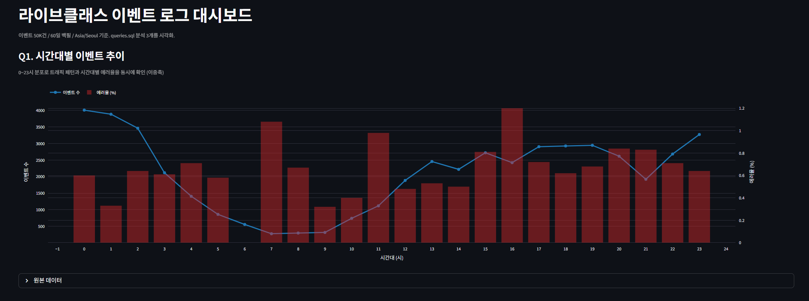
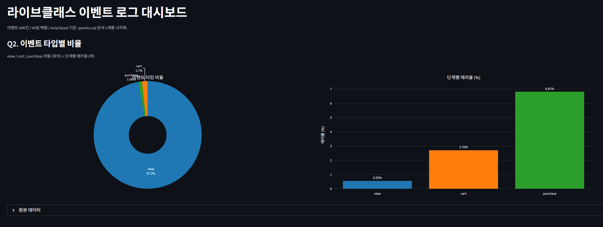
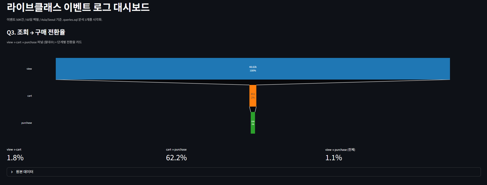

# 이벤트 로그 파이프라인

라이브클래스(온라인 강의 플랫폼)의 웹 서비스 이벤트 로그 파이프라인을 PostgreSQL + Docker Compose로 구현한 과제 프로젝트. **이벤트 생성 → 저장 → 사전 집계 → 분석 → 시각화**까지 단일 명령어로 자동화한다.

- 인프라 / 데이터 엔지니어링 인턴 과제 (라이브클래스)
- 데이터 규모: 200 유저 / 50,000 이벤트 / 60일 백필
- 결정론 보장 (`RANDOM_SEED=42`) — 누가 돌리든 동일 데이터

---

## 빠른 시작

전제 조건: Docker Desktop 또는 Docker Engine + Docker Compose v2.

```bash
git clone https://github.com/ssb3204/-_-_-.git
cd -_-_-
docker compose -p eventlog up --build -d
```

이 한 줄로 다음이 자동 수행된다:
1. PostgreSQL 16 컨테이너 기동
2. `init.sql` 자동 실행 (테이블 3개 + 인덱스 2개 생성)
3. db healthcheck 통과 대기
4. app 컨테이너 빌드 + 실행 (Python 3.14 + psycopg2)
5. 50,000 events / 200 users / 32,084 사전 집계 행 INSERT
6. app 종료 후 streamlit 컨테이너 기동 → `http://localhost:8501` 대시보드 접속 가능

> **한글 디렉토리명 주의**: 호스트 디렉토리명이 한글이면 docker compose가 기본 프로젝트명 슬러그를 깨뜨릴 수 있어 `-p eventlog` 명시 필요.

### 분석 쿼리 실행

```bash
docker exec -i eventlog_db psql -U app -d eventlog < queries.sql
```

### 종료

```bash
docker compose -p eventlog down       # 컨테이너만 제거 (데이터 보존)
docker compose -p eventlog down -v    # 컨테이너 + 볼륨 제거 (전체 초기화)
```

### 예상 출력 일부

```
eventlog_app  | Backfill window : [2026-02-25 00:00:00, 2026-04-26 00:00:00) KST
eventlog_app  | Generating users...
eventlog_app  |   200 users
eventlog_app  | Generating events...
eventlog_app  |   total           : 50,000
eventlog_app  |   view            : 48,620 (97.24%)
eventlog_app  |   cart            :    851 ( 1.70%)
eventlog_app  |   purchase        :    529 ( 1.06%)
eventlog_app  |   errors          :    328 ( 0.66%)
eventlog_app  |   sessions        : 29,788 (avg 1.68 ev/sess)
eventlog_app  | Inserting users...
eventlog_app  | Inserting events...
eventlog_app  | Aggregating to agg_event_summary...
eventlog_app  | Done.
```

---

## 아키텍처

```
        ┌──────────────────┐
        │   app container  │   (일회성 배치)
        │   python:3.14    │
        │ event_generator  │
        └────────┬─────────┘
                 │ INSERT users, events
                 │ TRUNCATE+INSERT agg
                 ▼
        ┌──────────────────┐     ┌─────────────────────┐
        │   db container   │     │ streamlit container  │
        │   postgres:16    │◄────│   python:3.14        │
        │  ┌────────────┐  │ SQL │  streamlit_app.py    │
        │  │ users      │  │     │  localhost:8501       │
        │  │ events     │  │     └─────────────────────┘
        │  │ agg_event… │  │
        │  └────────────┘  │
        └──────────────────┘
```

데이터 흐름:
1. **app**: state machine 기반 이벤트 생성 → events INSERT → agg_event_summary로 사전 집계 INSERT → 종료
2. **db**: 데이터 보존, 5432 포트 노출
3. **streamlit**: app 완료 후 기동, DB에서 직접 SELECT → Q1/Q2/Q3 차트 렌더링 → 8501 포트 노출

---

## DB 스키마

### `users`

```sql
CREATE TABLE users (
    user_id     VARCHAR(20) PRIMARY KEY,
    name        VARCHAR(50) NOT NULL,
    created_at  TIMESTAMP   NOT NULL,
    device_type VARCHAR(10) NOT NULL CHECK (device_type IN ('mobile', 'desktop'))
);
```

200명. 가입일은 백필 윈도우 시작 이전(60~90일 전)으로 설정.

### `events`

```sql
CREATE TABLE events (
    event_id    VARCHAR(20) PRIMARY KEY,
    user_id     VARCHAR(20) REFERENCES users(user_id),
    session_id  VARCHAR(20) NOT NULL,
    event_type  VARCHAR(10) NOT NULL CHECK (event_type IN ('view', 'cart', 'purchase')),
    error_check BOOLEAN     NOT NULL DEFAULT FALSE,
    lecture_id  VARCHAR(10),
    timestamp   TIMESTAMP   NOT NULL
);

CREATE INDEX idx_events_timestamp ON events(timestamp);
CREATE INDEX idx_events_user_id   ON events(user_id);
```

50,000건. 비정규화 raw 적재 테이블.

**설계 선택**:
- **비정규화 (선택)** vs 정규화: 이벤트 로그는 append-only이고 분석 쿼리에서 JOIN 비용이 부담. BigQuery / Redshift 같은 분석 DB의 철학과 일치. 프로덕션 환경이라면 sessions 테이블 분리도 고려 가능.
- **`error_check` BOOLEAN** vs `event_type='error'`: boolean 컬럼이 event_type과 직교 → 어느 단계(view/cart/purchase)에서 에러가 났는지 즉시 식별 (`event_type='purchase' AND error_check=TRUE` = 결제 실패).

### `agg_event_summary` (사전 집계 wide fact)

```sql
CREATE TABLE agg_event_summary (
    bucket_hour TIMESTAMP   NOT NULL,
    user_id     VARCHAR(20) NOT NULL REFERENCES users(user_id),
    event_type  VARCHAR(10) NOT NULL CHECK (event_type IN ('view','cart','purchase')),
    event_count INT         NOT NULL CHECK (event_count >= 0),
    error_count INT         NOT NULL CHECK (error_count >= 0 AND error_count <= event_count),
    PRIMARY KEY (bucket_hour, user_id, event_type)
);
```

32,084행. raw events를 `(시 단위 bucket, user_id, event_type)`으로 사전 집계한 단일 wide fact.

**도입 이유**: 분석별 특화 테이블을 여러 개 두는 대신, 단일 fact에 grain만 잡아두면 새 분석 쿼리는 SQL만 추가하면 되고 시각화 도구도 한 테이블만 보면 된다. `error_count <= event_count` CHECK로 논리 무결성 보장.

---

## 이벤트 생성기 설계

### 모델 — state machine

매 이벤트마다:

1. **시간 우선 샘플**: 시간대(hour) 결정 후, 해당 시간의 가중치 × `ACTION_RATIO`로 action 점수 계산 → action 결정
2. **lecture 결정**: cart는 누적 조회수 기반 벨커브 가중 (3~5회 시점에 피크), view는 균등, purchase는 cart된 강의 중 선택
3. **순서 보장**: 상태가 안 맞으면 view로 폴백 (view → cart → purchase 강제)
4. **상태 갱신**: `(user, lecture)` 페어별 view_count / cart / purchase 플래그 추적
5. `session_id`는 사후에 30분 활동 윈도우로 그룹핑 (Google Analytics 표준)

### 가중치 출처

Kaggle "eCommerce behavior data from multi category store" (mkechinov) 4,244만건 중 10% 청크 샘플(4,244,876건). UTC → KST 변환 후 event_type별로 시간대당 정규화하여 `VIEW_HOUR_WEIGHTS` / `CART_HOUR_WEIGHTS` / `PURCHASE_HOUR_WEIGHTS` 3개 dict 추출.

> **주의**: 러시아 이커머스 원자료를 KST로 단순 변환했기 때문에 새벽 view 트래픽이 한국 서비스치고 다소 높음. 시간 시프트 없이 원자료를 보존 (시계열 정확성보다 데이터 출처 명확성을 우선).

### 파라미터

| 파라미터 | 값 | 비고 |
|---|---|---|
| USER_COUNT | 200 | |
| EVENT_COUNT | 50,000 | |
| LECTURE_COUNT | 20 | |
| BACKFILL_DAYS | 60 | 실행 시점 기준 `[today-60d, today)` 분산 |
| HOUR_NOISE_PCT | ±20% | 시간 가중치에 시작 시 1회 적용 후 합 100 정규화 |
| SESSION_WINDOW_MIN | 30 | session_id 그룹핑 윈도우 |
| ZIPF_S | 1.0 | 유저 활동 분포 (상위 20% → ~80% 점유) |
| RANDOM_SEED | 42 | 결정론 보장 |

### 에러율 (글로벌 이커머스 벤치마크)

| 단계 | 에러율 | 근거 |
|---|---|---|
| view | 0.5% | 페이지 로딩 / 네트워크 |
| cart | 3% | 찜하기 기능 오류 |
| purchase | 8% | 결제 실패 (글로벌 8~15% 범위) |

---

## 시각화 결과

`docker compose up` 후 `http://localhost:8501` 에서 확인 가능한 Streamlit 대시보드.

**Q1. 시간대별 이벤트 추이**


**Q2. 이벤트 타입별 비율**


**Q3. 조회 → 구매 전환율**


---

## 분석 쿼리

3개 분석을 raw events 직접 / agg_event_summary 두 가지로 작성하여 동일 결과를 검증하고 EXPLAIN ANALYZE로 비용을 비교 (`queries.sql` 주석 첨부).

### Q1. 시간대별 이벤트 추이 (0~23시)

피크 18~19시(약 2,900건/시), 저점 7~9시(약 280건/시).

### Q2. 이벤트 타입 비율 + 타입별 에러율

| event_type | total | pct % | errors | error_rate % |
|---|---:|---:|---:|---:|
| view | 48,620 | 97.24 | 269 | 0.55 |
| cart | 851 | 1.70 | 23 | 2.70 |
| purchase | 529 | 1.06 | 36 | 6.81 |

→ "view가 압도적이지만 purchase 단계 에러율이 가장 높음" → 안정성 모니터링 시그널.

### Q3. 조회 대비 구매 전환율

전체 view 48,620 → purchase 529 = **1.09% 전환율**.

### raw vs agg 성능 비교 (50K events / 32K agg rows 기준)

| 쿼리 | raw (ms) | agg (ms) | buffers raw | buffers agg |
|------|---:|---:|---:|---:|
| Q1 | 9.84 | 4.99 | 519 | 238 |
| Q2 | 5.95 | 5.26 | 516 | 238 |
| Q3 | 4.47 | 2.74 | 516 | 238 |

50K 스케일에선 ms 단위 차이지만 buffers는 일관되게 **약 54% 감소** (516 → 238 페이지). 데이터가 10배~100배 늘면 격차 확대 예상.

---

## 설계 핵심 결정

전체 의사결정은 [`docs/DECISIONS.md`](docs/DECISIONS.md)에 Context / Decision / Alternatives / Tradeoffs 형식으로 누적 기록. 핵심만:

1. **PostgreSQL** (vs SQLite) — append-heavy 동시 쓰기, Docker 멀티 서비스, 분석 SQL 풍부함
2. **비정규화 events** — 분석 쿼리 JOIN 비용 회피, 분석 DB 철학
3. **error는 BOOLEAN 컬럼** — event_type과 직교, 단계 식별 즉시 가능
4. **state machine 생성기** (vs 세션 퍼널) — 부키팅 효과 제거, 구현 단순
5. **단일 wide fact 집계** (vs 분석별 특화 테이블) — 새 분석 추가가 SQL 추가만으로 가능
6. **raw vs agg EXPLAIN ANALYZE** — 외부 도구 의존 없는 PostgreSQL 내장 측정으로 fact 도입 효과 검증
7. **백필 1회 모드** (vs 스트리밍 / Airflow) — `docker compose up` 한 번으로 작동, 인턴 과제 스코프 부합

---

## 구현하면서 고민한 점

- **세션 퍼널 → state machine 전환**: 처음에는 세션 단위 퍼널 시뮬레이션을 채택했으나, 같은 세션 이벤트가 같은 시간 버킷에 몰리는 부키팅 효과와 session_id 의미 구성의 인위성이 우려되어 state machine 모델로 전환. session_id는 30분 활동 윈도우로 사후 그룹핑(GA 표준 정의)하는 방식으로 정리.

- **Kaggle 가중치 재추출**: 30만건 샘플로 event_type별 분리 시 cart/purchase 표본이 ~6,000건으로 노이즈가 컸음. 4,244만건의 10% 청크 샘플(4,244,876건)로 재추출하여 시간대당 표본 ~3,000+건 확보 → 분포 안정.

- **러시아 데이터 → 한국 서비스 매핑**: 추출값을 그대로 사용하고 README에 "데이터셋 영향으로 새벽 트래픽이 다소 높음" 명시. 시간 시프트나 핸드 디자인은 데이터 근거를 잃어 회피.

- **집계 도입 효과의 측정**: 50K 스케일에선 raw 쿼리도 충분히 빠름. 그래도 fact 테이블 패턴의 가치를 보여주기 위해 EXPLAIN ANALYZE로 buffers / 실행시간을 비교하는 방식 채택. 외부 벤치마크 도구 의존 없음.

- **결정론 vs 다양성**: `RANDOM_SEED=42` 고정으로 평가자가 README 숫자와 정확히 일치하는 결과를 얻는다. 매 실행 다른 데이터를 원하면 `event_generator.py`의 시드만 바꾸면 됨 (분포는 가중치에 박혀있어 큰 그림은 일관됨).

- **순차 ID vs UUID**: `event_id` / `session_id`를 UUID(36자) → 순차(`evt_NNNNN`, `sess_NNNNN`)로 변경. 로그 raw 조회 시 가독성·디버깅 편의를 우선. 분산 환경 무결성 요구가 없는 단일 머신 백필 시나리오라 충돌 가능성 없음.

---

## 디렉토리 구조

```
.
├── CLAUDE.md                  # 프로젝트 컨텍스트, 진행 규칙
├── Dockerfile                 # python:3.14-slim 기반 app 컨테이너
├── Dockerfile.streamlit       # python:3.14-slim 기반 streamlit 컨테이너
├── docker-compose.yml         # db + app + streamlit 서비스 정의
├── README.md                  # 본 파일
├── event_generator.py         # 이벤트 생성기 + 사전 집계 ETL
├── init.sql                   # PostgreSQL 스키마 초기화
├── queries.sql                # 분석 쿼리 + EXPLAIN ANALYZE 주석
├── requirements.txt           # psycopg2-binary, tzdata
├── requirements-streamlit.txt # streamlit, plotly, pandas, psycopg2-binary
├── streamlit_app.py           # 대시보드 (Q1 이중축 / Q2 파이+바 / Q3 퍼널)
├── docs/
│   ├── DECISIONS.md           # 의사결정 누적 기록
│   └── PROGRESS.md            # 세션별 진행 로그
└── scripts/
    └── extract_weights.py     # Kaggle 가중치 추출 일회성 유틸
```

---

## 제약 / 한계

- **분석 쿼리 실행은 수동**: `docker exec -i ... < queries.sql` 별도 명령 필요.
- **timestamp 절대값은 실행 날짜 의존**: backfill 윈도우가 "실행 시점 기준 최근 60일"이라 timestamp 연-월-일은 평가 시점에 따라 다름 (분포·카운트는 동일).
- **러시아 원자료 영향**: 새벽 view 비율이 한국 서비스치고 높음. 시간 시프트 없이 원자료 그대로 사용한 트레이드오프.
- **프로덕션 시뮬레이션은 백필 한정**: 실시간 수집(Kafka / Pub-Sub + Airflow DAG) 패턴은 미적용.
- **Python 3.14 의존**: `psycopg2-binary 2.9.12`가 cp314 wheel을 제공하기 시작한 최신 버전. 더 낮은 Python 버전에서는 호환되는 wheel 자동 선택됨.
